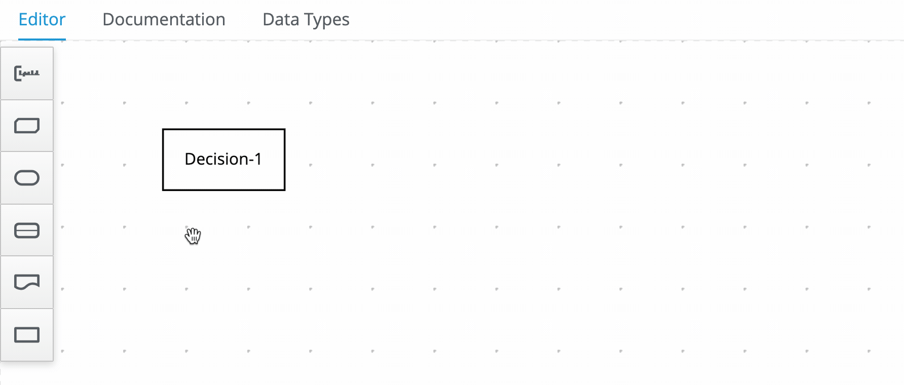
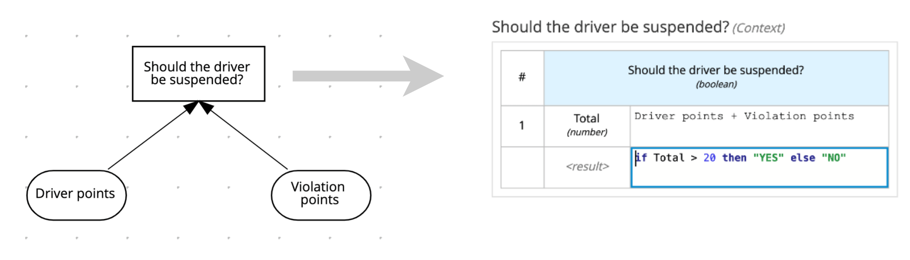
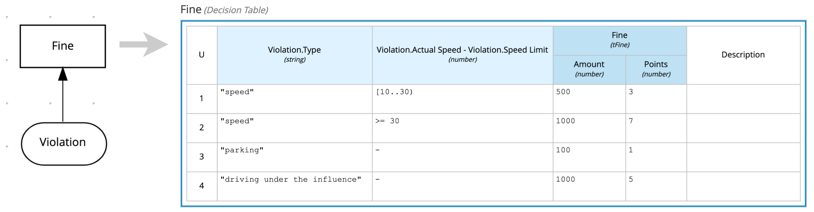
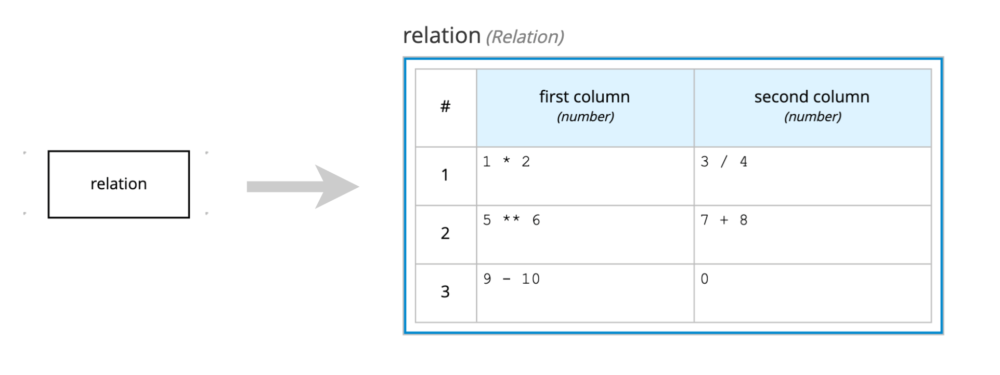
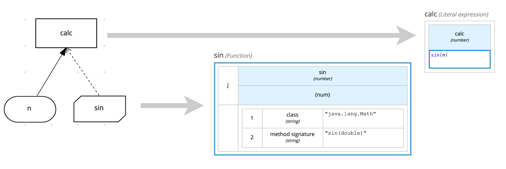
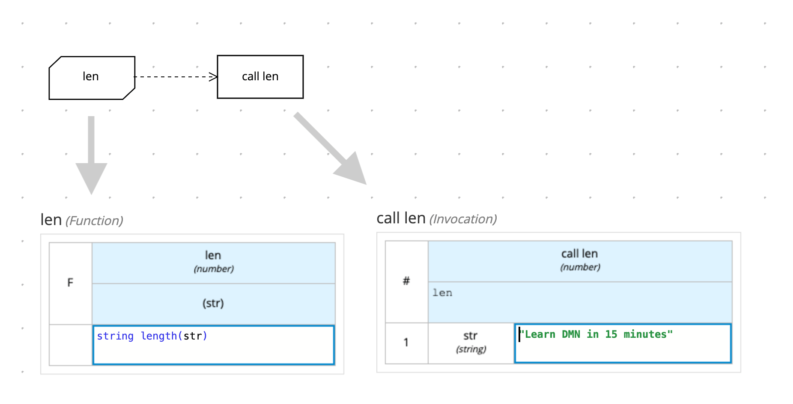
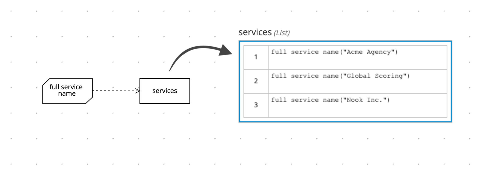

Decision nodes may express their logic by a variety of boxed expressions:



Let's check how each one works :-)

### 1. Literal expressions

Literal expressions hold a text (FEEL expression) that produces the output value.

### 2. Contexts

Contexts represent a collection of one or more key-value pairs, where the value is a decision logic, and the key is the respective identifier. The value can contain any type of expression: a literal expression, a decision table, a relation, function, an invocation, or even another context. Generally, contexts hold one or more local variables (values related to a local context). See an example of a Context key-value pair with an identifier and its literal expression:



Considering this example, when **Driver points** and **Violation points** are, respectively, `10` and `5`, the output node **Should the driver be suspended?** returns `"NO"`. However, with **Driver points** and **Violation points** with `10` and `15`, the output node **Should the driver be suspended?** returns `"YES"`.

### 3. Decision Tables

Decision tables are a tabular representation of conditional decision logic. The main elements are:

- Input columns (represented by the light blue header)
- Output columns (represented by the dark blue header)
- Hit Policy (represented by the letter in the top-left corner)



The mechanism is quite intuitive. Each row represents a rule, thus when the input matches, the respective output value is selected as the decision output. When multiple rows match, the hit policy decides the right row (generally, **Unique** is the best hit policy).

Considering the decision table above, check the following scenarios and their expected output:

```
/* === SCENARIO 1 === */

/* = Actual input data = */
"Violation": {
  "Type": "speed",
  "Speed Limit": 60,
  "Actual Speed": 100
}

/* = Expected output data = */
"Fine": {
  "Points": 7,
  "Amount": 1000
}
```

```
/* === SCENARIO 2 === */

/* = Actual input data = */
"Violation": {
  "Type": "speed",
  "Speed Limit": 60,
  "Actual Speed": 70
}

/* = Expected output data = */
"Fine": {
  "Points": 3,
  "Amount": 500
}
```

### 4. Relations

Relations are a pretty straightforward decision logic. They encapsulate lists of expressions:



This relation returns this:

```
[
  {
    "first column": 2,
    "second column": 0.75
  },
  {
    "first column": 15625,
    "second column": 15
  },
  {
    "first column": -1,
    "second column": 0
  }
]
```

### 5. Functions

Functions define reusable operations into your model. When you can't or don't want to use FEEL to express some specific logic, you can also call it from the PMML or Java world.



Usually, try to use business knowledge model nodes for defining functions, but you can define them on decision nodes as well, depending on your context.

### 6. Invocations

Invocations map the invocation for business knowledge model nodes:



If we execute the model above, we would get something like this:

```
{
  "len": "function len( str )",
  "call len": 23
}
```

### 7. Lists

Lists represent a group of FEEL expressions. You may use it to define complex items for a particular decision, like this:



Each cell of this the list above is calling a BKM function that returns a value for each item. Hence, the output for this list expression would be something like this:

```
"services": [
  "Acme Agency (status: running)",
  "Global Scoring (status: stopped)",
  "Nook Inc. (status: running)"
]
```

It's a pretty straight forward boxed expression.

<a class="button next-section" href="/learn/data-types">Next section →</a>
