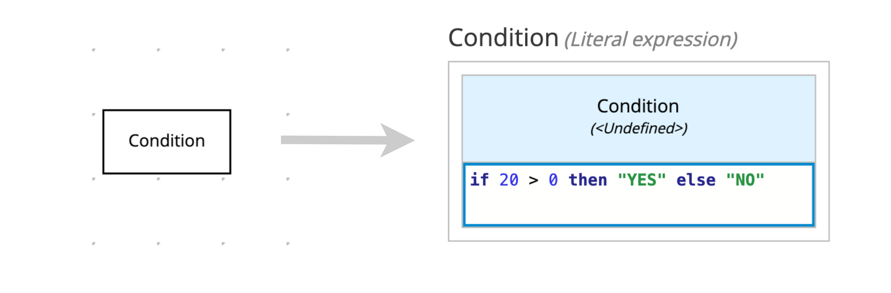

Literal expressions, decision tables, and many other DMN elements rely on textual expressions to work. The FEEL (Friendly Enough Expression Language) shines as a readable language for programmers and business analysts. The language design follows these principles:

- Side-effect free
- Simple data model with numbers, dates, strings, lists, and contexts
- Simple syntax designed for a broad audience
- Three-valued logic (true, false, null)

This section presents an example-guided approach, that shows the most used features of FEEL.

### Conditional statements

Here you can see an example of a decision node with a literal expression as the decision logic. Notice how the FEEL expression defines the output value:

You also could define different behaviors:

| Example                                      | Return value |
| -------------------------------------------- | ------------ |
| if 20 > 0 then "YES" else "NO"               | "YES"        |
| if (20 - (10 \* 2)) > 0 then "YES" else "NO" | "NO"         |
| if (2 \*\* 3) = 16 then "YES" else "NO"      | "YES"        |
| if (4 / 2) != 2 then "YES" else "NO"         | "NO"         |

### Loop statements

Loop statements can transform lists or verify if some elements satisfy a specific condition:

| Example                                   | Return value      |
| ----------------------------------------- | ----------------- |
| for i in [1, 2, 3, 4, 5] return i \* i    | [1, 4, 9, 16, 25] |
| some i in [1, 2, 3, 4, 5] satisfies i > 4 | true              |
| some i in [1, 2, 3, 4, 5] satisfies i > 5 | false             |

If you're curious about this kind of statement, you may try to discover more about this one: every i in [list] satisfies [condition] ;-)

### Range statements

Ranges have a tricky syntax to determine included and excluded elements in a given interval. The following examples clarify that by checking if some number is included in each range:

| Example       | Return value |
| ------------- | ------------ |
| 1 in [1..10]  | true         |
| 1 in (1..10]  | false        |
| 10 in [1..10] | true         |
| 10 in [1..10) | false        |

### String functions

FEEL has many useful functions to handle strings. Here you can see a list the most frequently used:

| Example                                           | Return value               |
| ------------------------------------------------- | -------------------------- |
| string length("Learn DMN in 15 minutes")          | 23                         |
| upper case("Learn DMN in 15 minutes")             | "LEARN DMN IN 15 MINUTES"  |
| lower case("Learn DMN in 15 minutes")             | "learn dmn in 15 minutes"  |
| substring("Learn DMN in 15 minutes", 7, 3)        | "DMN"                      |
| replace("Learn DMN in 15 minutes", "DMN", "FEEL") | "Learn FEEL in 15 minutes" |
| contains("Learn DMN in 15 minutes", "DMN")        | true                       |
| contains("Learn DMN in 15 minutes", "FEEL")       | false                      |
| string(123)                                       | "123"                      |

### Number functions

FEEL has many useful functions to handle numbers as well:

| Example | Return value |
| ------- | ------------ |
| abs(-1) | 1            |
| even(2) | true         |
| even(3) | false        |
| odd(4)  | false        |
| odd(5)  | true         |
| sqrt(9) | 3.0          |

### Date and Time functions

You can create date or time values by using strings or numbers, see:

| Example                                 | Return value               |
| --------------------------------------- | -------------------------- |
| date("2020-12-31")                      | [2020, 12, 31]             |
| date(2020, 12, 31)                      | [2020, 12, 31]             |
| time("14:59:59")                        | [14, 59, 59]               |
| time(14, 59, 59)                        | [14, 59, 59]               |
| date and time("2020-12-31T14:59:59")    | [2020, 12, 31, 14, 59, 59] |
| date and time(2020, 12, 31, 14, 59, 59) | [2020, 12, 31, 14, 59, 59] |
| day of week(date("2020-12-31"))         | "Thursday"                 |
| month of year(date("2020-12-31"))       | "December"                 |
| week of year(date("2020-12-31"))        | 53                         |

### List functions

Finally, FEEL has a bunch of functions to manipulate lists intuitively:

| Example                                       | Return value              |
| --------------------------------------------- | ------------------------- |
| concatenate([1, 2, 3], [4, 5])                | [1, 2, 3, 4, 5]           |
| count([1, 2, 3, 4, 5])                        | 5                         |
| distinct values([1, 1, 2, 2, 3, 3, 4, 5])     | [1, 2, 3, 4, 5]           |
| flatten([1, [2, 3], [4, 5]])                  | [1, 2, 3, 4, 5]           |
| max([1, 2, 3, 4, 5])                          | 5                         |
| mean([1, 2, 3, 4, 5])                         | 3                         |
| min([1, 2, 3, 4, 5])                          | 1                         |
| reverse([1, 2, 3, 4, 5])                      | [5, 4, 3, 2, 1]           |
| sort([5, 4, 1, 2, 3])                         | [1, 2, 3, 4, 5]           |
| sum([1, 2, 3, 4, 5])                          | 15                        |
| index of(["a", "b", "c", "d", "e", "f"], "c") | 3                         |
| append([1, 2, 3, 4, 5], 6)                    | [1, 2, 3, 4, 5, 6]        |
| list contains([1, 2, 3, 4, 5], 5)             | true                      |
| list contains([1, 2, 3, 4, 5], 6)             | false                     |
| remove(["a", "b", "c", "d", "e", "f"], 2)     | ["a", "c", "d", "e", "f"] |
| sublist([1, 2, 3, 4, 5], 2, 3)                | [2, 3, 4]                 |

Here you've learned the most frequently used FEEL expressions. There are other powerful features you may learn on the [DMN spec](https://www.omg.org/spec/DMN/1.2/PDF). If you're feeling inspired, take a look there :-)

<a class="button next-section" href="/learn/execution">Next section →</a>
